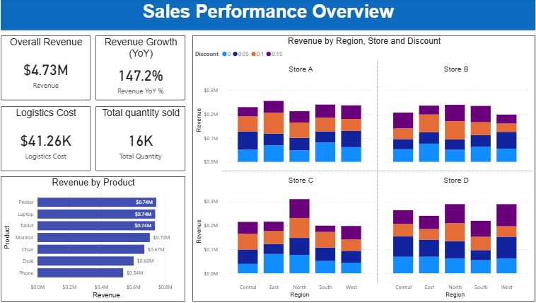
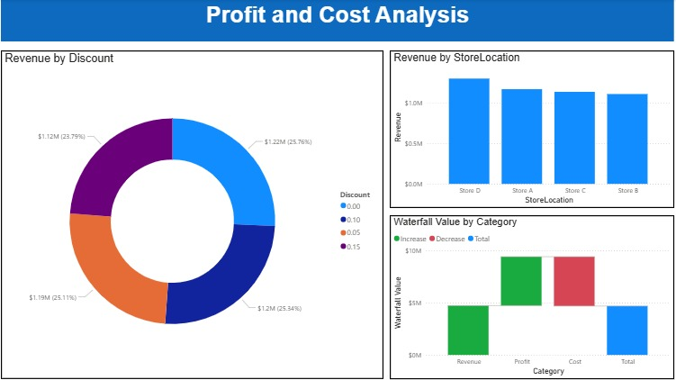

# Sales-Performance-Dashboard (Power BI)

## Overview
This project is a two-page interactive Power BI dashboard analyzing sales, revenue growth, cost, and profit performance.

## Pages Included
1. Sales Performance Overview
2. Profit and Cost Analysis

## Key Metrics
- Overall Revenue
- Revenue Growth (YoY)
- Logistics Cost
- Total Quantity Sold
- Revenue by Product
- Revenue by Store
- Waterfall (Revenue → Cost → Profit)

## Tools Used
- Power BI
- DAX
- Data Modeling

## Dashboard Preview

